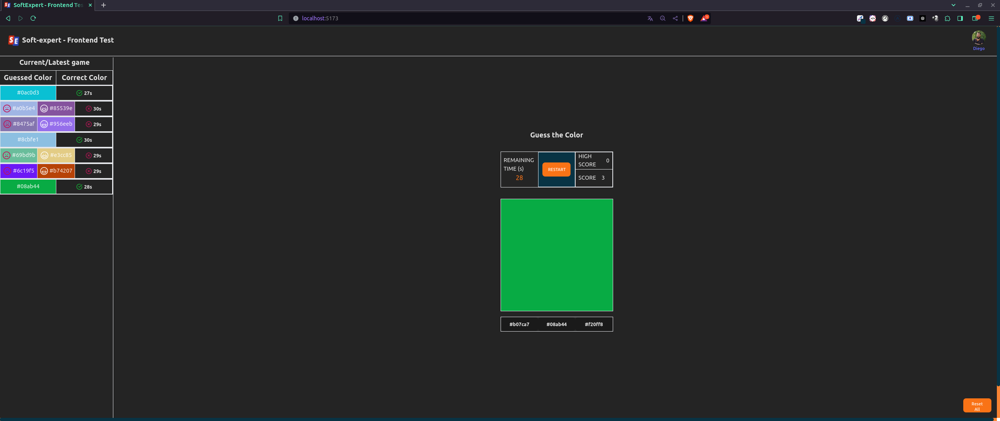

<h1 align="center">
    
</h1>
<h1 align="center">SoftExpert - Frontende Teste</h1>
<p align="center">Jogo Guess The Color desenvolvido para o teste para vaga de desenvolvedor frontend </p>

## Tecnologias
- [Vitejs](https://vitejs.dev/)
- [Tailwind](https://tailwindcss.com/)

## Questões do teste
Desafio frontend analytics
Olá, candidato! Preparamos um desafio, que consiste agregar vários conceitos que estão no dia a dia de um desenvolvedor frontend. A aplicação que deverá ser implementada por você, é um jogo que visa praticar a invejável habilidade daqueles que conseguem visualizar uma cor, apenas olhando para seu hexadecimal. Sim essas pessoas existem, acredite.

## Como o jogo funciona?
O jogo consiste em acertar o máximo possível de cores em 30s. Quando o jogo inicia, uma cor aleatória irá aparecer e para ela deverão aparecer 3 opções de resposta (obrigatoriamente em hexadecimal). Sendo duas incorretas (geradas aleatoriamente), e uma correta. A cada rodada, uma nova cor aparece, e o jogador terá 10s para responder e resultar em ganho ou perda de pontuação:

Se o jogador não responder a tempo, ele perde 2 pontos.
Se o jogador responder a tempo, mas errado, perderá 1 ponto.
Se o jogador responder a tempo e corretamente, ganhará 5 pontos.
Não deve ser possível pontuação negativa. O zero é a pontuação mínima permitida.

O jogo conta também com o máximo de pontuação que já foi feita em uma partida (representado no protótipo por HIGH SCORE). E a pontuação da partida atual (representada no protótipo por SCORE). Existirá também à esquerda, um histórico das cores referentes a partida atual, que dirá de forma visual quais o jogador acertou, quais errou, e em quanto tempo foram respondidas. A cada vez que uma partida é iniciada, essa pilha é resetada. (representada no protótipo por CURRENT/LATEST GAME).

## Funcionalidades obrigatórias
O jogo só deve começar quando o jogador decidir (representado no protótipo por START)
Caso o jogador atualize, ou feche a página:
HIGH SCORE deverá persistir.
Se um jogo estiver em andamento, ignorar e jogar fora seus dados. Voltando ao estado inicial com o botão START
Pilha referente a última partida concluída deverá persistir
Se o jogador quiser, ele poderá reiniciar a partida a qualquer momento (representado no protótipo por RESTART)
Se o jogador quiser, ele poderá limpar todos os dados já salvos pelo jogo. (representado no protótipo por RESET ALL DATA)
Ao começar o jogo, deve existir uma barra indicando 100% (30 segundos). Conforme o tempo vai diminuindo, a barra vai diminuindo proporcionalmente, até chegar em 0% (0 segundos).
Caso o usuário não forneça uma resposta dentro de 10s, uma resposta errada deve ser computada e a barra de progresso deve continuar sendo decrementanda. Ou seja, em um intervalo de 30s, caso o usuário não responda nenhuma vez, haverão 3 respostas erradas que foram computadas automaticamente pelo sistema (30 segundos divididos por 10 segundos resulta em 3).
Só deve existir uma barra que será decrementada, apesar de existirem dois timers paralelos rodando, sendo eles:
Timer geral (30s)
Sub timer limite para cada resposta (10s)
Toda vez que uma resposta nova é fornecida, o timer de 10s deve ser resetado, mas o de 30s continua.
A barra deve sempre refletir o timer geral (30s). O timer de 10s não deve ser representado visualmente na barra.

## Experiência do usuário
Como frontend, deverá haver um bom cuidado com UX, portanto alguns pontos a considerar:

Textos com fundo colorido deverão ter contraste agradável, definindo automaticamente se o texto terá uma cor escura ou clara a depender de seu fundo
A cada rodada, o painel lateral deverá funcionar como um pilha, ou seja, jogar as mais recentes no topo.
O painel lateral deverá poder crescer verticalmente e infinitamente, e o scroll deverá existir apenas nele.
Animações simples serão muito bem-vindas.

## Stack
Frontend: ReactJS (JS)
Considerações e recomendações técnicas
Será muito bem avaliado a quantidade de bibliotecas utilizada em seu projeto. Dica: menos é mais. Afinal, queremos ver suas habilidades como dev JS.
Pensamos em um projeto visualmente simples. Portanto evite ao máximo libs externas para componentes visuais. Ex.: Bootstrap, MaterialUI etc.
Uso de hooks, custom hooks, contexto serão muito bem-vindos.
Muito cuidado com componentização e performance dos componentes
Testes unitários (framework a sua escolha)

## Instalação
Para instalar as dependências, clone o projeto e rode:
```bash
# Instalar as dependências
$ yarn
$ yarn dev
```
Abrirá no navegador no endereço: [http://localhost:5555/](http://localhost:5173/)
<h1 align="center">
    
</h1>

Made with ♥ by Diego Andrade :wave: [Get in touch!](https://www.linkedin.com/in/diego-r-andrade/)
